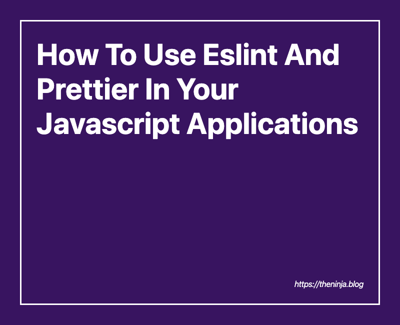

# gridsome-plugin-blog-cover
Automatically create cover images for your blog posts

## Installation

```bash
npm install gridsome-plugin-blog-cover

```

## Setup
Ensure you have a [Cloudinary](https://cloudinary.com) account, `@gridsome/source-filesystem` and `@gridsome/transformer-remark` installed as well.
Add the code after registering `@gridsome/source-filesystem` as a plugin.

```js
  plugins: [
    //...
    {
      use: 'gridsome-plugin-blog-cover',
      options: {
        typeName: 'Post',
        outputDir: './content/images', 
        domain: 'https://example.com',
        coverField: 'cover_image',
        cloud_name: 'YOUR_CLOUDINARY_CLOUD_NAME',
        api_key: 'YOUR_CLOUDINARY_API_KEY',
        api_secret: 'YOUR_CLOUDINARY_API_SECRET'
      }
    }
  ]

```

### Plugin options

#### `typeName` [required]
The collection name for your posts.
  * expected value: `String`
  * default: `Post`

#### `outputDir` [required]
The directory to generate the cover images in, this should be relative to your project's root directory
  * expected value: `String`
  * default: `content/images/`

#### `domain` [required]
The url of your blog site
  * expected value: `String`
  * default: `https://awesomeblog.com`

#### `coverField` [required]
The field used for cover images
  * expected value: `String`
  * default: `cover_image`

#### `cloud_name` [required]
Your cloudinary cloud name
  * expected value: `String`

#### `api_key` [required]
Your cloudinary API key
  * expected value: `String`

#### `api_secret` [required]
Your cloudinary API secret
  * expected value: `String`

#### `upload_folder`
The folder to use for all uploads on Cloudinary
  * expected value: `String`
  * default: `blog_covers`

#### `border`
Have a thin white border around the content
 * expected value: `Boolean`
 * default: `true`

#### `backgroundColors`
An array of Hex color codes to use for backgrounds
  * expected value: `Array`
  * default: `['#30475e', '#381460', '#ba6b57', '#21243d', '#434e52']` 

#### `imgHeight`
A desired minimum height for the image
  * expected value: `String`
  * default: `650px`

#### `imgWidth`
A desired minmum width for the image
  * expected value: `String`
  * default: `700px`

## Usage
```graphql
<page-query>
query{
  posts: allPost{
    edges{
      node{
        id
        title
        cover_image # or your specified cover field
      }
    }
  }
}
</page-query>
``` 
## Example

---
Pleas support me on Patreon if you find this package helpful :)
[](https://www.patreon.com/bePatron?u=19608418)